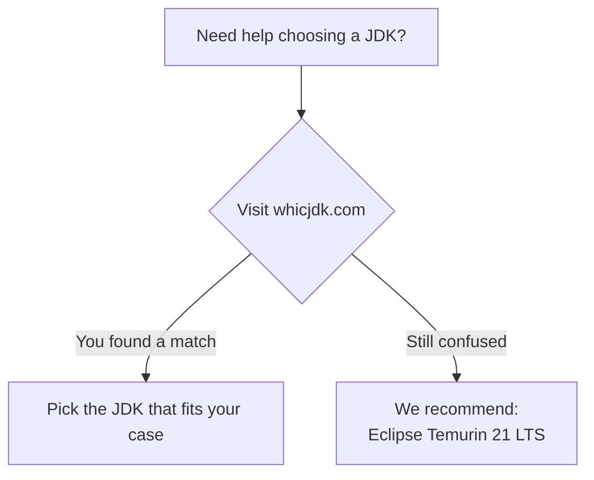



This post is written for experienced developers who are new to macOS and want a **clean, modern, and professional-grade Java setup**. The focus is deliberately narrow. We will not cover basics like "What is the difference between JRE and JDK?". We *will* explain, in deailt, macOS-specific Java behavior, vendor differences, and why certain approaches scale better over time.

- Apple Silicon (M-series chips such as M1, M2, M3, or later) - all installation methods, paths, and recommendations are made with the ARM64 ("aarch64") macOS ecosystem in mind.
- macOS Tahoe 26.1
- Java 25 (LTS) — ALWAYS use the LTS version only; for more info refer  [Java Almanac](https://javaalmanac.io/)

# Table of Contents
- [Why Java Setup on macOS Is “Different”](#why-java-setup-on-macos-is-different)
- [Java 25 LTS: Why LTS Is the Only Sensible Default](#java-25-lts-why-lts-is-the-only-sensible-default)
- [JDK Vendors You Should Care About](#jdk-vendors-you-should-care-about)
  - [1. Oracle OpenJDK](#1-oracle-openjdk)
  - [2. Eclipse Temurin (Adoptium)](#2-eclipse-temurin-adoptium)
  - [3. Amazon Corretto](#3-amazon-corretto)
- [macOS Java Internals You Must Understand](#macos-java-internals-you-must-understand)
  - [/usr/bin/java — The Apple Java Wrapper](#usrbinjava--the-apple-java-wrapper)
  - [/usr/libexec/java_home — The Brain](#usrlibexecjava_home--the-brain)
- [Installing Java on macOS — All Major Options](#installing-java-on-macos--all-major-options)
  - [1. GUI Installers (DMG / PKG)](#1-gui-installers-dmg--pkg)
  - [2. Homebrew](#2-homebrew)
  - [3. SDKMAN](#3-sdkman)
  - [4. asdf](#4-asdf)
  - [5. mise (formerly rtx)](#5-mise-formerly-rtx)
  - [6. Foojay (Discovery + Gradle Integration)](#6-foojay-discovery--gradle-integration)
- [Setting JAVA_HOME Correctly on macOS](#setting-java_home-correctly-on-macos)
  - [Recommended (Dynamic)](#recommended-dynamic)
  - [Manual (Static, Not Recommended Long-Term)](#manual-static-not-recommended-long-term)
- [IDE Integration (High Level)](#ide-integration-high-level)
  - [IntelliJ IDEA](#intellij-idea)
  - [Eclipse](#eclipse)
  - [VS Code](#vs-code)
- [Recommended Setups (Opinionated)](#recommended-setups-opinionated)
  - [Single-JDK, Minimal Setup](#single-jdk-minimal-setup)
  - [Multi-Project, Multi-JDK](#multi-project-multi-jdk)
  - [CI-First, Zero Drift](#ci-first-zero-drift)
- [Official Links](#official-links)
- [Appendix 1](#appendix-1)

---

# Why Java Setup on macOS Is "Different"

On Linux, Java setup is mostly transparent. On Windows, it is explicit.  
On macOS, Java is **subtle**.

macOS ships with:
- A **Java launcher stub** at `/usr/bin/java`
- A system utility called **`/usr/libexec/java_home`**

But **macOS does not ship a JDK**.

This distinction matters.

Take a look at the output when you type `java`:

```bash
$ java
The operation couldn’t be completed. Unable to locate a Java Runtime.
Please visit http://www.java.com for information on installing Java.
```

macOS may respond with a dialog prompting you to install Java — even though no JDK is present. This behavior comes from Apple’s Java wrapper, not from Java itself.

Understanding this wrapper is key to avoiding confusion later.

# Java 25 LTS: Why LTS Is the Only Sensible Default

Java 25 is a Long-Term Support (LTS) release. For most developers:
- LTS versions receive security updates
- Tooling (Gradle, Maven, IDEs) targets LTS first
- Production systems standardize on LTS

Unless you are:
- Testing preview features
- Contributing to OpenJDK
- Tracking incubator APIs

Use the latest LTS.

To verify the current LTS release, rely on:
- OpenJDK: https://openjdk.org
- Foojay (official OpenJDK discovery): https://foojay.io
- Oracle Java SE roadmap: https://www.oracle.com/java/technologies/java-se-support-roadmap.html

---

# JDK Vendors You Should Care About

All modern JDKs are built from OpenJDK, but vendors differ in:
- Licensing
- Update cadence
- Long-term guarantees
- Enterprise friendliness

> Still unsure which JDK to pick? Here's a simple flowchart to get you started:



## 1. Oracle OpenJDK

Homepage: https://jdk.java.net
- Reference implementation
- Free to use
- Short update window for non-LTS builds
- Canonical source of truth

Good for: purity, experimentation, staying closest to upstream.

---

## 2. Eclipse Temurin (Adoptium)

Homepage: https://adoptium.net
- Community-backed
- Widely used in CI/CD
- Predictable updates
- Excellent macOS support

Good for: most developers, teams, CI pipelines.

---

## 3. Amazon Corretto

Homepage: https://aws.amazon.com/corretto/
- Long-term patches
- Conservative defaults
- Strong production reputation

Good for: backend services, cloud-native Java, long-lived systems.

---

# macOS Java Internals You Must Understand

## /usr/bin/java — The Apple Java Wrapper

This binary:
- Is provided by macOS
- Delegates execution to the active JDK
- Uses `JAVA_HOME` or `java_home` internally

It is not the Java executable from your JDK.

---

## /usr/libexec/java_home — The Brain

This utility:
- Discovers installed JDKs
- Selects versions based on constraints
- Outputs the correct `JAVA_HOME`

---

# Installing Java on macOS — All Major Options

## 1. GUI Installers (DMG / PKG)

**Oracle / Adoptium / Corretto DMG**
- Download a `.dmg`
- Drag-and-drop or run installer
- JDK installs under `/Library/Java/JavaVirtualMachines`

**Pros**
- Zero friction
- Works well for single-JDK setups
- Automatically registered with `java_home`

**Cons**
- Poor version switching
- Manual upgrades
- Not automation-friendly

**Recommended if:** You want one JDK, minimal tooling, and no version juggling.

---

## 2. Homebrew

Homepage: https://brew.sh

Install example:

```bash
brew install openjdk@25
```

Set environment variables:

```bash
export JAVA_HOME=$(/usr/libexec/java_home -v 25)
```

**Pros**
- Simple
- Familiar to macOS users
- Good integration with system tools

**Cons**
- Limited multi-version ergonomics
- Brew upgrades can change behavior unexpectedly

**Recommended if:** You already rely heavily on Homebrew and want simplicity.

---

## 3. SDKMAN

Homepage: https://sdkman.io

Install Java 25:

```bash
sdk install java 25-tem
```

Switch versions:

```bash
sdk use java 25-tem
```

**Pros**
- Best Java-centric version manager
- Multiple vendors supported
- Project-local `.sdkmanrc`

**Cons**
- Shell-dependent
- Slight startup overhead

**Recommended if:** You regularly switch JDKs or work across multiple Java projects.

---

## 4. asdf

Homepage: https://asdf-vm.com

Install plugin:

```bash
asdf plugin add java
asdf install java temurin-25
asdf global java temurin-25
```

**Pros**
- Unified version manager (Java, Node, Python, etc.)
- Reproducible environments

**Cons**
- Heavier mental model
- Java plugin semantics vary

**Recommended if:** You want one tool to manage everything.

---

## 5. mise (formerly rtx)

Homepage: https://mise.jdx.dev

Install Java:

```bash
mise install java@25
mise use -g java@25
```

**Pros**
- Faster than asdf
- Modern UX
- `.mise.toml` support

**Cons**
- Newer ecosystem
- Smaller Java-specific community

**Recommended if:** You want a fast, modern, polyglot toolchain manager.

---

## 6. Foojay (Discovery + Gradle Integration)

Homepage: https://foojay.io

Foojay is not just a download site — it is the authoritative OpenJDK discovery service.

**Gradle Foojay Toolchain Plugin**

This is the cleanest approach for build reproducibility.

`build.gradle` (Groovy DSL):

```groovy
plugins {
    id 'java'
    id 'org.gradle.toolchains.foojay-resolver-convention' version '0.9.0'
}

java {
    toolchain {
        languageVersion = JavaLanguageVersion.of(25)
    }
}
```

Gradle will:
- Download the correct JDK
- Cache it
- Ignore system Java entirely

**Pros**
- Zero global configuration
- Perfect CI parity
- Vendor-neutral

**Cons**
- Build-tool-specific
- Requires Gradle

**Recommended if:** You value reproducibility over manual control.

---

# Setting JAVA_HOME Correctly on macOS

## Recommended (Dynamic)

```bash
export JAVA_HOME=$(/usr/libexec/java_home -v 25)
```

This survives:
- Vendor changes
- Patch updates
- Reinstalls

## Manual (Static, Not Recommended Long-Term)

```bash
export JAVA_HOME=/Library/Java/JavaVirtualMachines/temurin-25.jdk/Contents/Home
```

Use only if you must hard-pin paths.

---

# IDE Integration (High Level)

## IntelliJ IDEA
- Auto-detects installed JDKs
- Supports SDKMAN, Homebrew, DMG installs
- Best-in-class Java experience on macOS

## Eclipse
- Relies on `JAVA_HOME`
- Works best with system-installed JDKs

## VS Code
- Requires Java extensions
- Uses `JAVA_HOME` or toolchains

No IDE-specific installation steps are required if Java is configured correctly at the OS level.

---

# Recommended Setups (Opinionated)

## Single-JDK, Minimal Setup
- Eclipse Temurin DMG
- `java_home`
- IntelliJ IDEA

## Multi-Project, Multi-JDK
- SDKMAN or mise
- Foojay Gradle plugin
- IntelliJ IDEA

## CI-First, Zero Drift
- Foojay toolchains
- No global Java dependency

---

# Official Links

- OpenJDK: https://openjdk.org
- Foojay: https://foojay.io
- Oracle Java: https://www.oracle.com/java/
- Eclipse Temurin: https://adoptium.net
- Amazon Corretto: https://aws.amazon.com/corretto/
- SDKMAN: https://sdkman.io
- Homebrew: https://brew.sh
- asdf: https://asdf-vm.com
- mise: https://mise.jdx.dev

---

# Appendix 1

A matrix of installation methods and JDK vendor/version availability:

<table>
  <thead>
    <tr>
      <th>JDK Vendor</th>
      <th>Version</th>
      <th style="text-align: center;">Homebrew</th>
      <th style="text-align: center;">mise</th>
      <th style="text-align: center;">SDKMAN</th>
    </tr>
  </thead>
  <tbody>
    <tr>
      <td rowspan="5"><b>OpenJDK</b></td>
      <td>8</td>
      <td style="text-align: center;">{{ check }}</td>
      <td style="text-align: center;"></td>
      <td style="text-align: center;"></td>
    </tr>
    <tr>
      <td>11</td>
      <td style="text-align: center;">{{ check }}</td>
      <td style="text-align: center;"></td>
      <td style="text-align: center;"></td>
    </tr>
    <tr>
      <td>17</td>
      <td style="text-align: center;">{{ check }}</td>
      <td style="text-align: center;"></td>
      <td style="text-align: center;"></td>
    </tr>
    <tr>
      <td>21</td>
      <td style="text-align: center;">{{ check }}</td>
      <td style="text-align: center;"></td>
      <td style="text-align: center;"></td>
    </tr>
    <tr>
      <td>25</td>
      <td style="text-align: center;">{{ check }}</td>
      <td style="text-align: center;"></td>
      <td style="text-align: center;"></td>
    </tr>
    <tr>
      <td rowspan="5"><b>Amazon Corretto</b></td>
      <td>8</td>
      <td style="text-align: center;">{{ check }}</td>
      <td style="text-align: center;"></td>
      <td style="text-align: center;"></td>
    </tr>
    <tr>
      <td>11</td>
      <td style="text-align: center;">{{ check }}</td>
      <td style="text-align: center;"></td>
      <td style="text-align: center;"></td>
    </tr>
    <tr>
      <td>17</td>
      <td style="text-align: center;">{{ check }}</td>
      <td style="text-align: center;"></td>
      <td style="text-align: center;"></td>
    </tr>
    <tr>
      <td>21</td>
      <td style="text-align: center;">{{ check }}</td>
      <td style="text-align: center;"></td>
      <td style="text-align: center;"></td>
    </tr>
    <tr>
      <td>25</td>
      <td style="text-align: center;">{{ check }}</td>
      <td style="text-align: center;"></td>
      <td style="text-align: center;"></td>
    </tr>
    <tr>
      <td rowspan="5"><b>Eclipse Temurin</b></td>
      <td>8</td>
      <td style="text-align: center;">{{ check }}</td>
      <td style="text-align: center;"></td>
      <td style="text-align: center;">{{ check }}</td>
    </tr>
    <tr>
      <td>11</td>
      <td style="text-align: center;">{{ check }}</td>
      <td style="text-align: center;">{{ check }}</td>
      <td style="text-align: center;">{{ check }}</td>
    </tr>
    <tr>
      <td>17</td>
      <td style="text-align: center;">{{ check }}</td>
      <td style="text-align: center;">{{ check }}</td>
      <td style="text-align: center;">{{ check }}</td>
    </tr>
    <tr>
      <td>21</td>
      <td style="text-align: center;">{{ check }}</td>
      <td style="text-align: center;">{{ check }}</td>
      <td style="text-align: center;">{{ check }}</td>
    </tr>
    <tr>
      <td>25</td>
      <td style="text-align: center;">{{ check }}</td>
      <td style="text-align: center;">{{ check }}</td>
      <td style="text-align: center;">{{ check }}</td>
    </tr>
  </tbody>
</table>

*Table: JDK version availability by installation tool (as of Dec 2025)*


